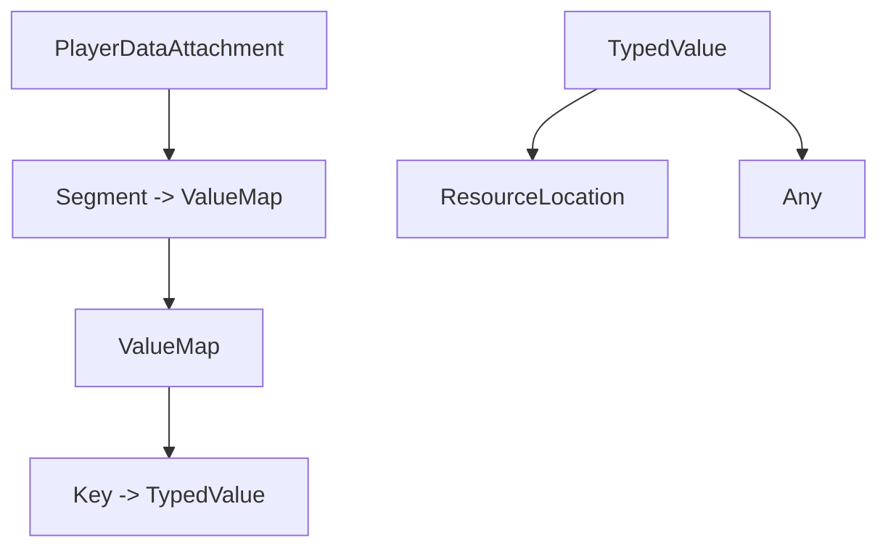

# Player Data Capability Design Guide

This guide walks through the process of creating a **single player-attached capability** that can store multiple segments of data, each of which supports **strongly-typed primitive values** (strings, numbers, booleans, etc.). The walkthrough covers:

- Conceptual overview of NeoForge capabilities and attachments
- Designing a segmented data container for player-specific state
- Registering codecs so values can be serialized, saved, and synced
- Implementing the capability wrapper and helper accessors
- Adding, retrieving, and clearing values in code
- Recommended conventions for new data points (keys, getters, and setters)
- Example usage that stores guild-specific information (name, faction, leadership flag)

> Although the examples use NeoForge 1.21.x conventions, the same structure applies to Forge with minor naming differences.

---

## 1. Core Capability Concepts

1. **Capability** – A typed API that other code can query from an entity (`ServerPlayer`, `ItemStack`, etc.) to access additional behaviour or data.
2. **Attachment** – NeoForge’s data storage abstraction. Attachments are immutable snapshots that serialize with codecs and synchronize to clients when replaced.
3. **Provider** – The bridge between an entity and its capability. Providers expose the capability instance and manage the attachment snapshot that backs it.
4. **Codec** – A serializer/deserializer used by attachments to save values to NBT and transmit them over the network.

Our goal is to back a player capability with an attachment that supports **segmented, typed key/value pairs**. Each segment groups related values (e.g., `guild`, `stats`, `economy`). Each key remembers:

- Segment identifier (`ResourceLocation`)
- Type identifier (to pick the correct codec)
- Actual value

---

## 2. Data Model Blueprint

Design a reusable data model that embraces immutability. One practical layout:



### 2.1 PlayerDataAttachment
- Holds an immutable `Map<ResourceLocation, Map<ResourceLocation, TypedValue>>`.
- Provides helper methods to `get`, `set`, or `clear` values by segment/key pair.
- When `set` is called, returns a **new** `PlayerDataAttachment` so the provider can sync the change.

### 2.2 PlayerDataKey
Create a lightweight key class that bundles segment and name into a type-safe identifier:

```java
public record PlayerDataKey<T>(ResourceLocation segment, ResourceLocation name, PlayerDataType<T> type) {
    public Optional<T> get(PlayerDataAttachment data) { ... }
    public PlayerDataAttachment set(PlayerDataAttachment data, @Nullable T value) { ... }
}
```

### 2.3 PlayerDataType
Encapsulate supported primitive types:

```java
public record PlayerDataType<T>(ResourceLocation id, Codec<T> codec) {
    public static final PlayerDataType<String> STRING = of("string", Codec.STRING);
    public static final PlayerDataType<Boolean> BOOL = of("bool", Codec.BOOL);
    public static final PlayerDataType<Integer> INT = of("int", Codec.INT);
    // ... add more as needed
}
```

Register these in a central registry so they can be referenced when defining keys.

### 2.4 Typed Value Payload
Store the actual type id and the encoded value. A minimal representation can be:

```java
public record PlayerDataValue(ResourceLocation typeId, Object value) {
    // codec that writes the type ID, then delegates to the matching codec
}
```

When encoding/decoding, look up the `PlayerDataType` by `typeId` to serialize correctly. Throw a descriptive error if the type is unknown.

---

## 3. Attachment Registration

Register an `AttachmentType<PlayerDataAttachment>` during common setup:

```java
public final class PlayerDataAttachments {
    public static final DeferredRegister<AttachmentType<?>> ATTACHMENTS =
        DeferredRegister.create(NeoForgeRegistries.ATTACHMENT_TYPES, MOD_ID);

    public static final RegistryObject<AttachmentType<PlayerDataAttachment>> PLAYER_DATA =
        ATTACHMENTS.register("player_data", () -> AttachmentType.builder(PlayerDataAttachment::empty)
            .serializer(PlayerDataAttachment.CODEC)
            .copyOnDeath()
            .build());
}
```

Key points:
- **`serializer`** references a codec on the attachment that knows how to encode the map of segments and typed values.
- **`copyOnDeath()`** ensures values persist through player respawns (adjust based on your design).

Call `PlayerDataAttachments.ATTACHMENTS.register(eventBus);` inside your mod constructor.

---

## 4. Capability Definition

Define the capability interface and wrapper:

```java
public interface PlayerDataCapability {
    <T> Optional<T> get(PlayerDataKey<T> key);
    <T> void set(PlayerDataKey<T> key, @Nullable T value);
    void clearSegment(ResourceLocation segment);

    // Guild-focused defaults
    default Optional<String> guildName() { return get(GUILD_NAME); }
    default void setGuildName(@Nullable String name) { set(GUILD_NAME, name); }
    // ... faction + leadership helpers
}
```

Implementation details:
1. Hold a reference to the owning `Player` and the current `PlayerDataAttachment` snapshot.
2. When `set` is called:
   - Compute the new attachment via `key.set(currentAttachment, value)`.
   - If the snapshot changed, invoke `player.setData(PlayerDataAttachments.PLAYER_DATA.get(), newAttachment);` so NeoForge syncs it to the client automatically.
3. Expose capability retrieval via a static helper:

```java
public static LazyOptional<PlayerDataCapability> get(Player player) {
    return player.getCapability(PlayerDataCapabilities.PLAYER_DATA_CAPABILITY);
}
```

Register the capability during `RegisterCapabilitiesEvent`:

```java
public final class PlayerDataCapabilities {
    public static final Capability<PlayerDataCapability> PLAYER_DATA_CAPABILITY =
        CapabilityManager.get(new CapabilityToken<>() {});

    public static void register(RegisterCapabilitiesEvent event) {
        event.register(PlayerDataCapability.class);
    }
}
```

---

## 5. Provider & Attachment Sync

Bind the capability to players by creating a provider that manages the attachment snapshot:

```java
public class PlayerDataProvider implements ICapabilityProvider, INBTSerializable<CompoundTag> {
    private PlayerDataAttachment data = PlayerDataAttachment.empty();
    private final LazyOptional<PlayerDataCapability> optional = LazyOptional.of(() -> new PlayerDataImpl(this));

    @Override
    public <T> LazyOptional<T> getCapability(Capability<T> cap, @Nullable Direction side) {
        return cap == PlayerDataCapabilities.PLAYER_DATA_CAPABILITY ? optional.cast() : LazyOptional.empty();
    }

    @Override
    public CompoundTag serializeNBT() {
        return PlayerDataAttachment.CODEC.encodeStart(NbtOps.INSTANCE, data).result().orElse(new CompoundTag());
    }

    @Override
    public void deserializeNBT(CompoundTag nbt) {
        data = PlayerDataAttachment.CODEC.parse(NbtOps.INSTANCE, nbt).result().orElse(PlayerDataAttachment.empty());
    }

    void setAttachment(PlayerDataAttachment newData, ServerPlayer player) {
        if (newData != data) {
            data = newData;
            player.setData(PlayerDataAttachments.PLAYER_DATA.get(), newData);
        }
    }

    PlayerDataAttachment data() { return data; }
}
```

Attach this provider to players in the appropriate event (e.g., `AttachCapabilitiesEvent<Entity>`). When the player logs in, sync the current attachment using `player.setData(...)` so the client receives an up-to-date snapshot.

---

## 6. Defining Guild Keys (Example Segment)

Group all guild-related values under a `guild` segment. Define constants so they can be reused throughout the codebase:

```java
public final class GuildDataKeys {
    public static final ResourceLocation SEGMENT = new ResourceLocation(MOD_ID, "guild");

    public static final PlayerDataKey<String> GUILD_NAME = PlayerDataKey.string(SEGMENT, MOD_ID, "guild_name");
    public static final PlayerDataKey<String> FACTION_NAME = PlayerDataKey.string(SEGMENT, MOD_ID, "faction_name");
    public static final PlayerDataKey<Boolean> IS_LEADER = PlayerDataKey.bool(SEGMENT, MOD_ID, "is_leader");

    private GuildDataKeys() {}
}
```

The helper factories (`PlayerDataKey.string`, `PlayerDataKey.bool`, etc.) supply the right `PlayerDataType` for primitive codecs, so keys are fully configured with segment, name, and type.

---

## 7. Capability Getters & Setters

To keep usage ergonomic, expose guild-specific methods directly on your capability implementation:

```java
public class PlayerDataImpl implements PlayerDataCapability {
    private final PlayerDataProvider provider;
    private final ServerPlayer player;

    PlayerDataImpl(PlayerDataProvider provider, ServerPlayer player) {
        this.provider = provider;
        this.player = player;
    }

    @Override
    public <T> Optional<T> get(PlayerDataKey<T> key) {
        return key.get(provider.data());
    }

    @Override
    public <T> void set(PlayerDataKey<T> key, @Nullable T value) {
        PlayerDataAttachment updated = key.set(provider.data(), value);
        provider.setAttachment(updated, player);
    }

    @Override
    public void clearSegment(ResourceLocation segment) {
        PlayerDataAttachment updated = provider.data().clear(segment);
        provider.setAttachment(updated, player);
    }

    // Guild helpers
    @Override
    public Optional<String> guildName() { return get(GuildDataKeys.GUILD_NAME); }

    @Override
    public void setGuildName(@Nullable String name) { set(GuildDataKeys.GUILD_NAME, name); }

    @Override
    public Optional<String> factionName() { return get(GuildDataKeys.FACTION_NAME); }

    @Override
    public void setFactionName(@Nullable String name) { set(GuildDataKeys.FACTION_NAME, name); }

    @Override
    public boolean isFactionLeader() { return get(GuildDataKeys.IS_LEADER).orElse(false); }

    @Override
    public void setFactionLeader(boolean leader) { set(GuildDataKeys.IS_LEADER, leader); }
}
```

### Adding New Data Points
1. **Create a key** using the helper that matches the value’s type (`string`, `int`, `bool`, etc.). Decide which segment it belongs to.
2. **Expose accessors** on the capability interface and implementation:
   - Getter returns the correct primitive type or `Optional<T>`.
   - Setter calls `set(key, value)`; passing `null` removes the value from the attachment.
3. **Use the getter/setter** anywhere your mod logic needs to read or write the data.

This approach keeps the capability strongly typed and discoverable: new keys live alongside their segment definition, and the capability interface advertises domain-specific helpers.

---

## 8. Command & Gameplay Integration Example

Imagine a simple `/guild join <name> <faction>` command:

```java
PlayerDataCapability cap = PlayerDataCapability.get(player).orElseThrow(...);
cap.setGuildName(guildName);
cap.setFactionName(factionName);
cap.setFactionLeader(false);
```

When the player becomes a leader:

```java
cap.setFactionLeader(true);
```

And when they leave the guild entirely:

```java
cap.clearSegment(GuildDataKeys.SEGMENT);
```

Because each setter goes through the attachment provider, NeoForge automatically synchronizes the updated attachment to the client and persists the state in the player’s save data.

---

## 9. Saving & Loading Behaviour

- **World Saves**: During chunk save, NeoForge serializes the attachment using the codec you registered. Typed values retain their type IDs, ensuring they decode correctly even if the order changes.
- **Client Sync**: Whenever `setAttachment` replaces the snapshot, NeoForge pushes a sync packet to the client, keeping UI logic in step with server state.
- **Death & Respawn**: Use `copyOnDeath()` during registration to persist data across deaths. Remove it if you prefer the data to reset when the player respawns.

---

## 10. Testing Checklist

1. Join a server with the mod installed.
2. Run administrative commands or scripted events that modify guild data.
3. Relog to confirm values persist through save/load cycles.
4. Trigger leader toggles or segment clears and verify the client reflects changes instantly.
5. Inspect the player’s NBT (e.g., with `/data get entity <player>`) to ensure the stored values appear under your segment.

---

## 11. Extensibility Tips

- **Custom Types**: Register additional `PlayerDataType` entries for complex data (e.g., enums, records) by providing a codec.
- **Validation**: Wrap setters in validation logic if certain segments require invariants (e.g., guild name must be non-empty when `isLeader` is true).
- **Tooling**: Implement debug commands (like `/guilddata get|set|clear`) to help server operators inspect and modify stored values.
- **Documentation**: Keep a central README or this guide updated so contributors know how to add new keys and accessors.

---

### Summary
By combining NeoForge attachments with a segmented, type-aware data model, you can expose a single player capability that scales gracefully as your mod tracks additional gameplay attributes. Primitive values remain strongly typed, easy to serialize, and trivial to extend—just declare a new key, add the corresponding getter/setter, and plug the capability into your gameplay systems.
